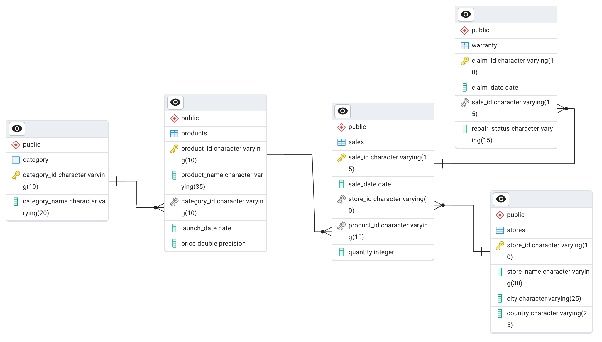

# Apple Retail Sales - SQL Data Analysis Project

## Project Overview

This project showcases advanced SQL querying techniques through the analysis of over **1 million rows of Apple retail sales data**. The dataset I worked with included information about products, stores, sales transactions, and warranty claims across various Apple retail locations globally. By tackling a variety of questions, from basic to complex, I hope to demonstrate my ability to write sophisticated SQL queries that extract valuable insights from large datasets.

As an aspiring data analyst I thought this project was ideal to demonstrate my SQL skills by working with a large-scale dataset and solving real-world business questions.

## Entity Relationship Diagram (ERD)



---

### What this project features:

- **20+ Advanced SQL Queries**: solutions for complex queries, enhancing my SQL skills in performance tuning and optimization.
- **EDR of 5 Tables**: Namely sales, stores, product categories, products, and warranties.
- **Query Performance Tuning**: Demonstrating how I optimized queries for real-world data handling.
- **Portfolio-Ready Project**: Showcasing SQL expertise through large-scale data analysis.

### Why Did I choose this Project?
- **Hands-on Learning**: To gain practical experience with complex datasets and advanced business problem-solving.

- **Comprehensive Coverage**: Each table provided me with new opportunities to explore SQL concepts.

## Database Schema

This project used five main tables:

1. **stores**: Contains information about Apple retail stores.
   - `store_id`: Unique identifier for each store.
   - `store_name`: Name of the store.
   - `city`: City where the store is located.
   - `country`: Country of the store.

2. **category**: Holds product category information.
   - `category_id`: Unique identifier for each product category.
   - `category_name`: Name of the category.

3. **products**: Details about Apple products.
   - `product_id`: Unique identifier for each product.
   - `product_name`: Name of the product.
   - `category_id`: References the category table.
   - `launch_date`: Date when the product was launched.
   - `price`: Price of the product.

4. **sales**: Stores sales transactions.
   - `sale_id`: Unique identifier for each sale.
   - `sale_date`: Date of the sale.
   - `store_id`: References the store table.
   - `product_id`: References the product table.
   - `quantity`: Number of units sold.

5. **warranty**: Contains information about warranty claims.
   - `claim_id`: Unique identifier for each warranty claim.
   - `claim_date`: Date the claim was made.
   - `sale_id`: References the sales table.
   - `repair_status`: Status of the warranty claim (e.g., Paid Repaired, Warranty Void).

## Objectives

The project is split into three tiers of questions to test SQL skills of increasing complexity:

### Easy to Medium (10 Questions)

1. Find the number of stores in each country.
```sql
SELECT
    country,
    COUNT(store_id) AS total_stores
FROM stores
GROUP BY country
ORDER BY total_stores DESC;
```

2. Calculate the total number of units sold by each store.

```sql
SELECT
    s.store_id,
    st.store_name,
    SUM(s.quantity) AS total_units_sold
FROM sales AS s
JOIN stores AS st
    ON st.store_id = s.store_id
GROUP BY s.store_id, st.store_name
ORDER BY total_units_sold DESC;
```

3. Identify how many sales occurred in December 2023.
```sql
SELECT
    COUNT(sale_id) AS total_sales
FROM sales
WHERE TO_CHAR(sale_date, 'MM-YYYY') = '12-2023';
```
4. Determine how many stores have never had a warranty claim filed.
```sql
SELECT COUNT(*)
FROM stores
WHERE store_id NOT IN (
    SELECT DISTINCT store_id
    FROM sales AS s
    RIGHT JOIN warranty AS w
        ON s.sale_id = w.sale_id
);
```
5. Calculate the percentage of warranty claims marked as "Warranty Void".
```sql
-- Number of claims as wv / total claim * 100

SELECT
    ROUND(
        COUNT(claim_id) * 100.0 / (SELECT COUNT(*) FROM warranty),
        0
    ) AS warranty_void_percentage
FROM warranty
WHERE repair_status = 'Warranty Void';
```
6. Identify which store had the highest total units sold in the last year.
```sql
SELECT
    s.store_id,
    st.store_name,
    SUM(s.quantity) AS total_units_sold
FROM sales AS s
JOIN stores AS st
    ON s.store_id = st.store_id
WHERE sale_date >= CURRENT_DATE - INTERVAL '1 year'
GROUP BY s.store_id, st.store_name
ORDER BY total_units_sold DESC
LIMIT 1;
```
7. Count the number of unique products sold in the last year.
```sql
SELECT
    COUNT(DISTINCT product_id) AS unique_products_sold
FROM sales
WHERE sale_date >= CURRENT_DATE - INTERVAL '1 year';
```
8. Find the average price of products in each category.
```sql
SELECT
    p.category_id,
    c.category_name,
    ROUND(AVG(p.price)::numeric, 2) AS avg_price
FROM products AS p
JOIN category AS c
    ON p.category_id = c.category_id
GROUP BY p.category_id, c.category_name
ORDER BY avg_price DESC;
```
9. How many warranty claims were filed in 2020?
```sql
SELECT
    COUNT(*) AS warranty_claims
FROM warranty
WHERE EXTRACT(YEAR FROM claim_date) = 2020;
```
10. For each store, identify the best-selling day based on highest quantity sold.
```sql
-- store_id, day_name, sum(qty)
-- dense rank window function

SELECT *
FROM (
    SELECT
        store_id,
        TO_CHAR(sale_date, 'Day') AS day_name,
        SUM(quantity) AS total_units_sold,
        RANK() OVER (PARTITION BY store_id ORDER BY SUM(quantity) DESC) AS rank
    FROM sales
    GROUP BY store_id, day_name
) AS t1
WHERE rank = 1;
```

### Medium to Hard (5 Questions)

11. Identify the least selling product in each country for each year based on total units sold.
```sql
WITH product_rank AS (
    SELECT
        st.country,
        p.product_name,
        SUM(s.quantity) AS total_qty_sold,
        RANK() OVER (PARTITION BY st.country ORDER BY SUM(s.quantity)) AS rank
    FROM sales AS s
    JOIN stores AS st
        ON s.store_id = st.store_id
    JOIN products AS p
        ON s.product_id = p.product_id
    GROUP BY st.country, p.product_name
)
SELECT *
FROM product_rank
WHERE rank = 1;
```
12. Calculate how many warranty claims were filed within 180 days of a product sale.
```sql
SELECT
    COUNT(*) AS claims_within_180_days
FROM warranty AS w
LEFT JOIN sales AS s
    ON w.sale_id = s.sale_id
WHERE w.claim_date - s.sale_date <= 180;
```
13. Determine how many warranty claims were filed for products launched in the last two years.
```sql
-- each product
-- number of claims
-- numnber of sales
-- each product must have been launched within the last 2 years

SELECT
    p.product_name,
    COUNT(w.claim_id) AS number_claims,
    COUNT(s.sale_id) AS total_sales
FROM warranty AS w
RIGHT JOIN sales AS s
    ON s.sale_id = w.sale_id
JOIN products AS p
    ON p.product_id = s.product_id
WHERE p.launch_date >= CURRENT_DATE - INTERVAL '2 years'
GROUP BY p.product_name
HAVING COUNT(w.claim_id) > 0;
```
14. List the months in the last three years where sales exceeded 5,000 units in the USA.
```sql
SELECT 
    TO_CHAR(s.sale_date, 'MM-YYYY') AS month,
    SUM(s.quantity) AS total_units_sold
FROM 
    sales AS s
JOIN 
    stores AS st
    ON s.store_id = st.store_id
WHERE 
    st.country = 'USA'
    AND s.sale_date >= CURRENT_DATE - INTERVAL '3 years'
GROUP BY 
    TO_CHAR(s.sale_date, 'MM-YYYY')
HAVING 
    SUM(s.quantity) > 5000;
```
15. Identify the product category with the most warranty claims filed in the last two years.
```sql
SELECT 
    c.category_name,
    COUNT(w.claim_id) AS total_claims
FROM 
    warranty AS w
LEFT JOIN 
    sales AS s
    ON w.sale_id = s.sale_id
JOIN 
    products AS p
    ON p.product_id = s.product_id
JOIN 
    category AS c
    ON c.category_id = p.category_id
WHERE 
    w.claim_date >= CURRENT_DATE - INTERVAL '2 years'
GROUP BY 
    c.category_name
ORDER BY 
    total_claims DESC;
```

### Complex (5 Questions)

16. Determine the percentage chance of receiving warranty claims after each purchase for each country.
```sql
WITH country_claims AS (
    SELECT 
        st.country,
        SUM(s.quantity) AS total_units_sold,
        COUNT(w.claim_id) AS total_claims
    FROM 
        sales AS s
    JOIN 
        stores AS st
        ON s.store_id = st.store_id
    LEFT JOIN 
        warranty AS w
        ON w.sale_id = s.sale_id
    GROUP BY 
        st.country
)
SELECT 
    country,
    total_units_sold,
    total_claims,
    ROUND(
        COALESCE((total_claims::NUMERIC / total_units_sold::NUMERIC) * 100, 0), 
        2
    ) AS risk_percentage
FROM 
    country_claims
ORDER BY 
    risk_percentage DESC;
```
17. Analyze the year-by-year growth ratio for each store.
```sql
-- find each store and yearly sales.
WITH yearly_sales AS (
    SELECT
        s.store_id,
        st.store_name,
        EXTRACT(YEAR FROM sale_date) AS year,
        SUM(s.quantity * p.price) AS total_sale
    FROM sales AS s
    JOIN products AS p
        ON s.product_id = p.product_id
    JOIN stores AS st
        ON st.store_id = s.store_id
    GROUP BY s.store_id, st.store_name, year
    ORDER BY st.store_name, year
),
growth_ratio AS (
    SELECT
        store_name,
        year,
        LAG(total_sale, 1) OVER (PARTITION BY store_name ORDER BY year) AS last_year_sale,
        total_sale AS current_year_sale
    FROM yearly_sales
)

SELECT
    store_name,
    year,
    last_year_sale,
    current_year_sale,
    ROUND(
        (current_year_sale - last_year_sale)::NUMERIC /
        last_year_sale::NUMERIC * 100, 2
    ) AS growth_ratio
FROM growth_ratio
WHERE
    last_year_sale IS NOT NULL
    AND year <> EXTRACT(YEAR FROM CURRENT_DATE);
```
18. Calculate the correlation between product price and warranty claims for products sold in the last five years, segmented by price range.
```sql
SELECT 
    CASE
        WHEN p.price < 500 THEN 'Less Expensive Product'
        WHEN p.price BETWEEN 500 AND 1000 THEN 'Mid-Range Product'
        ELSE 'Expensive Product'
    END AS price_segment,
    COUNT(w.claim_id) AS total_claims
FROM 
    warranty AS w
LEFT JOIN 
    sales AS s
    ON w.sale_id = s.sale_id
JOIN 
    products AS p
    ON p.product_id = s.product_id
WHERE 
    w.claim_date >= CURRENT_DATE - INTERVAL '5 years'
GROUP BY 
    price_segment;
```
19. Identify the store with the highest percentage of "Paid Repaired" claims relative to total claims filed.
```sql
WITH paid_repair AS (
    SELECT 
        s.store_id,
        COUNT(w.claim_id) AS paid_repaired
    FROM 
        sales AS s
    RIGHT JOIN 
        warranty AS w
        ON w.sale_id = s.sale_id
    WHERE 
        w.repair_status = 'Paid Repaired'
    GROUP BY 
        s.store_id
),
total_repair AS (
    SELECT 
        s.store_id,
        COUNT(w.claim_id) AS total_repaired
    FROM 
        sales AS s
    RIGHT JOIN 
        warranty AS w
        ON w.sale_id = s.sale_id
    GROUP BY 
        s.store_id
)
SELECT 
    tr.store_id,
    st.store_name,
    pr.paid_repaired,
    tr.total_repaired,
    ROUND(
        (pr.paid_repaired::NUMERIC / tr.total_repaired::NUMERIC) * 100, 
        2
    ) AS percentage_paid_repaired
FROM 
    paid_repair AS pr
JOIN 
    total_repair AS tr
    ON pr.store_id = tr.store_id
JOIN 
    stores AS st
    ON tr.store_id = st.store_id
```
20. Write a query to calculate the monthly running total of sales for each store over the past four years and compare trends during this period.
```sql
WITH monthly_sales AS (
    SELECT 
        s.store_id,
        EXTRACT(YEAR FROM s.sale_date) AS year,
        EXTRACT(MONTH FROM s.sale_date) AS month,
        SUM(p.price * s.quantity) AS total_revenue
    FROM 
        sales AS s
    JOIN 
        products AS p
        ON s.product_id = p.product_id
    WHERE 
        s.sale_date >= CURRENT_DATE - INTERVAL '4 years'
    GROUP BY 
        s.store_id, year, month
    ORDER BY 
        s.store_id, year, month
),
monthly_trends AS (
    SELECT 
        store_id,
        year,
        month,
        total_revenue,
        SUM(total_revenue) OVER (PARTITION BY store_id ORDER BY year, month) AS running_total,
        LAG(total_revenue) OVER (PARTITION BY store_id ORDER BY year, month) AS previous_month_revenue
    FROM 
        monthly_sales
)
SELECT 
    store_id,
    year,
    month,
    total_revenue,
    running_total,
    previous_month_revenue,
    ROUND(
        CASE 
            WHEN previous_month_revenue IS NOT NULL AND previous_month_revenue > 0 THEN
                (total_revenue::numeric - previous_month_revenue::numeric) / previous_month_revenue::numeric * 100
            ELSE 
                NULL
        END, 
    2) AS month_over_month_change
FROM 
    monthly_trends
ORDER BY 
    store_id, year, month;
```
21. Analyze product sales trends over time, segmented into key periods: from launch to 6 months, 6-12 months, 12-18 months, and beyond 18 months.
```sql
SELECT 
    p.product_name,
    CASE
        WHEN s.sale_date BETWEEN p.launch_date AND p.launch_date + INTERVAL '6 months' THEN '0-6 months'
        WHEN s.sale_date BETWEEN p.launch_date + INTERVAL '6 months' AND p.launch_date + INTERVAL '12 months' THEN '6-12 months'
        WHEN s.sale_date BETWEEN p.launch_date + INTERVAL '12 months' AND p.launch_date + INTERVAL '18 months' THEN '12-18 months'
        ELSE '18 months+'
    END AS product_life_cycle,
    SUM(s.quantity) AS total_quantity_sold
FROM 
    sales AS s
JOIN 
    products AS p
    ON s.product_id = p.product_id
GROUP BY 
    p.product_name, product_life_cycle
ORDER BY 
    p.product_name, total_quantity_sold DESC;
```

## Project Focus

This project primarily focused on developing and showcasing the following SQL skills:

- **Complex Joins and Aggregations**: Demonstrating the ability to perform complex SQL joins and aggregate data meaningfully.
- **Window Functions**: Using advanced window functions for running totals, growth analysis, and time-based queries.
- **Data Segmentation**: Analyzing data across different time frames to gain insights into product performance.
- **Correlation Analysis**: Applying SQL functions to determine relationships between variables, such as product price and warranty claims.
- **Real-World Problem Solving**: Answering business-related questions that reflect real-world scenarios faced by data analysts.


## Dataset

- **Size**: 1 million+ rows of sales data.
- **Period Covered**: The data spans multiple years, allowing for long-term trend analysis.
- **Geographical Coverage**: Sales data from Apple stores across various countries.

## Conclusion

By completing this project, I have developed advanced SQL querying skills, improved my ability to handle large datasets, and have gained practical experience in solving complex data analysis problems that I believe are crucial for business decision-making. This project is an excellent addition to my portfolio and hope it will demonstrate my expertise in SQL to potential employers.# applestore_app_data_analysis
Data analysis to gather insights into what app is best to develop based on the findings.


